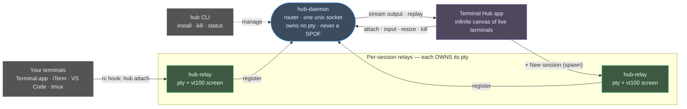

<h1 align="center">Terminal Hub</h1>

<p align="center"><b>Terminal mission control.</b> Capture every interactive shell you open and manage them all from one window — plus spawn your own.</p>

<p align="center">
  
  
  
  
  
</p>

---

Terminal Hub is a lightweight system that **captures the terminals you open** (Terminal.app, iTerm, VS Code, tmux panes, …) and lets you **view and drive every one of them from a single desktop app** — an infinite, pannable canvas of live terminal windows. You can also spawn hub-owned sessions that outlive the terminal that made them.

Capture is **opt-in, consent-gated, and fully reversible**. Nothing is captured until you say yes; one click reverts everything.

> A terminal you kill from Terminal Hub really dies. A hub-owned session you spawn keeps running until you kill it. The background router can crash and **your shells survive** — there's no system-wide single point of failure.

> The command-line tool and paths are named `hub` (`hub install`, `~/.hub`); the project is **Terminal Hub**.

## Table of contents
- [Features](#features)
- [How it works](#how-it-works)
- [Platform support](#platform-support)
- [Quick start](#quick-start)
  - [Option A — Install from npm (recommended)](#option-a--install-from-npm-recommended)
  - [Option B — Build from source (macOS / Linux)](#option-b--build-from-source-macos--linux)
  - [Option C — Try it in Docker (no install)](#option-c--try-it-in-docker-no-install)
- [Usage](#usage)
- [Configuration](#configuration)
- [Uninstall](#uninstall)
- [Roadmap / vision](#roadmap--vision)
- [Development](#development)
- [Security](#security)

## Features

**Capture & control**
- 🪝 **Auto-capture** every interactive shell via a one-time, consent-gated shell-rc hook.
- 🖥️ **Two views of one shell** — drive a session from hub *and* from the terminal it was spawned in.
- ➕ **Spawn hub-owned sessions** that persist independently of any terminal.
- 🗂️ **Session buckets** — Healthy / Ghost (dead socket) / Orphan (live, no record), so nothing gets lost.

**The canvas**
- 🪟 Terminals are **floating windows** — drag the title bar to move, drag the corner to resize.
- 🔭 **Infinite pannable / zoomable canvas** — drag empty space to pan, ⌘/Ctrl-scroll to zoom, **Fit** to frame them all. Lay terminals out in a row, a grid, wherever.
- 🔌 Attach / **Detach** (stop viewing, session keeps running) and **Kill** (end the shell), with in-button progress.

**Correct & safe**
- 🛡️ **No single point of failure** — each session owns its own pty in a detached process; killing the router never kills a shell.
- 🔐 **Authenticated** — per-install token + same-uid peer-credential check on every socket.
- ⌨️ **Real terminal behavior** — raw-mode passthrough (arrow keys, tab-completion, Ctrl-C all work), no double-echo.
- ↩️ **Reversible** — uninstall reverts the rc change, removes `~/.hub`, and (on macOS) trashes the app.

## How it works



- **`hub-relay`** — one process per session. It **owns the pty** and a headless vt100 screen (for replay), fully detached (setsid + double-fork). Because the shell lives here, the router can die and restart without touching your shells.
- **`hub-daemon`** — a non-pty **reverse-proxy router** over a single unix socket. It knows every session and fans viewers out to the right relay. It owns no pty, so it is never a SPOF.
- **`hub-cli` (`hub`)** — install / uninstall / reconcile / kill / status. Owns the rc-file editing (marker-guarded, byte-exact backup, edit-preserving restore) and autostart (launchd on macOS, systemd on Linux).
- **`hub-app`** — the desktop GUI: an infinite canvas of terminal windows, per-tile connection to the daemon.

## Platform support

| Platform | Status | Notes |
|---|:---:|---|
| **macOS** (Apple Silicon & Intel) | ✅ Supported | launchd autostart, `.app` bundle |
| **Linux** (x86_64 & arm64) | ✅ Supported | systemd user unit, `.deb`/AppImage or run the binary; verified end-to-end (engine + GUI) |
| **Windows** | 🚧 In progress | See [Roadmap](#roadmap--vision) |

## Quick start

### Option A — Install from npm (recommended)

One command, every platform — no build:

```bash
npm i -g terminal-hub
```

Then:
- **Launch the GUI:** run `terminal-hub`, or click **Terminal Hub** in your apps menu — Launchpad/Spotlight (macOS), the app grid (Linux), or the Start Menu (Windows). The install registers it automatically.
- **Use the CLI:** `hub status`, `hub kill <id>`, `hub uninstall`, …

On **first launch**, Terminal Hub asks to enable capture — click **Enable**, then open a new terminal and it shows up.

Notes:
- **macOS:** no Gatekeeper warning — the launcher isn't quarantined, so no code-signing is needed.
- **Linux:** the GUI needs the webkit runtime — `sudo apt install libwebkit2gtk-4.1-0` (the launcher tells you if it's missing).
- **Windows:** binaries are phase 2 — see [Roadmap](#roadmap--vision).
- **Uninstall:** `npm rm -g terminal-hub` (also removes the apps-menu entry). To revert capture too, run `hub uninstall` first.

### Option B — Build from source (macOS / Linux)

**Prerequisites**
- [Rust](https://rustup.rs) (stable) and [Node.js](https://nodejs.org) 18+ with npm.
- **macOS:** Xcode Command Line Tools — `xcode-select --install`.
- **Linux (Debian/Ubuntu):**
  ```bash
  sudo apt install libwebkit2gtk-4.1-dev libgtk-3-dev libayatana-appindicator3-dev \
                   librsvg2-dev build-essential curl file libssl-dev pkg-config
  ```

**Build**
```bash
git clone <this-repo> && cd <this-repo>/hub/app
npm install
npm run tauri:build      # builds the engine binaries + the app
```

**Run** the app that was built:
- **macOS:** `open ../target/release/bundle/macos/hub.app`
- **Linux:** `../target/release/hub-app` (or install the generated `.deb`/AppImage under `../target/release/bundle/`)

On **first launch**, Terminal Hub asks to enable capture. Click **Enable** — this adds a guarded, reversible line to your `~/.zshrc` (or `~/.bashrc`), drops the binaries in `~/.hub/bin`, and starts the background service. Then **open a new terminal** and it shows up in the app.

### Option C — Try it in Docker (no install)

Want to kick the tires without installing anything? Run a full **Ubuntu 24.04 + XFCE desktop** with Terminal Hub inside, streamed to your browser. Any terminal you open inside gets captured.

```bash
cd hub
docker build -f docker/ubuntu-gui/Dockerfile -t hub-ubuntu-gui .
docker run -d --name hub-gui -p 8080:8080 --shm-size=1g hub-ubuntu-gui
```

Then open **http://localhost:8080/vnc.html** → **Connect**. Open a terminal from the XFCE panel and watch it appear in the hub.

```bash
docker logs -f hub-gui     # boot progress
docker stop hub-gui        # stop
docker rm -f hub-gui       # remove
```

> First build is heavy (~10–15 min: webkit + Rust + frontend) and the image is ~5.5 GB.

## Usage

- **Capture a terminal** — just open a new terminal after enabling. It appears under **Healthy** as an `External` session.
- **Open a tile** — click a session (or **Open**) to bring up its live terminal on the canvas.
- **Move / resize** — drag the title bar to move a window; drag the bottom-right corner to resize (the shell's size follows).
- **Pan / zoom** — drag empty canvas to pan, ⌘/Ctrl-scroll to zoom toward the cursor, **Fit** to frame all windows, **%** to reset.
- **New hub session** — **+ New session** spawns a hub-owned shell that persists until killed.
- **Detach vs Kill** — **Detach** stops viewing (the session keeps running); **Kill** ends the shell for everyone.
- **Two views** — a captured terminal is live both in its original window and in hub, simultaneously.

## Configuration

- **Bypass capture for one shell:** `HUB_DISABLE=1` in the environment skips the hook.
- **Turn capture off globally:** uninstall (below), or comment out the marked block in your rc file.
- **Scrollback buffer:** set per-tile scrollback in **Settings** (applies to newly opened tiles).

## Uninstall

- **From the app:** Settings → **Uninstall hub & remove app** — reverts the rc line (preserving any edits you made after install), stops the service, deletes `~/.hub`, and moves the app to the Trash.
- **From the CLI:** `hub uninstall`

Uninstall is surgical: it removes **only** hub's own block from your rc file and leaves everything else untouched.

## Roadmap / vision

Terminal Hub today is a solid macOS + Linux terminal manager. Where it's headed:

- 🪟 **Windows support (in progress)** — the current engine leans on POSIX (unix sockets, `fork`/`setsid`, termios). Windows needs named-pipe transport, a `CreateProcess`-based detach, console-mode raw handling, a PowerShell-profile capture hook, Windows peer-credential auth, and Task Scheduler autostart. This is the active next milestone.
- 🧩 **Layouts & workspaces** — save/restore canvas arrangements; named workspaces.
- 🧷 **Persistence options** — opt-in "keep external sessions alive after their terminal closes."
- 🖱️ **Canvas polish** — edge-resize (not just corner), snap/tiling helpers, minimap.
- 📦 **Prebuilt releases** — signed macOS `.dmg`, Linux `.deb`/AppImage, so no build step.
- 🔭 **Remote sessions** — securely attach to relays on another host.

## Development

```bash
# engine (Rust workspace) — from hub/
cargo test --workspace                 # unit + integration tests (real-binary E2E, SPOF, capture, ...)
cargo build --release -p hub-cli -p hub-daemon -p hub-relay

# GUI — from hub/app/
npm install
npm run tauri dev                      # hot-reload the frontend against the real backend
npm run test:e2e                       # Playwright smokes (mocked IPC)
npm run tauri:build                    # produce the packaged app
```

Layout:
```
hub/
├── crates/
│   ├── hub-proto       # wire types + framing
│   ├── hub-pty         # portable-pty wrapper
│   ├── hub-term        # headless vt100 screen + replay
│   ├── hub-transport   # framed async conn + auth (token + peer-uid)
│   ├── hub-relay       # per-session pty owner (detach, raw-term, resize)
│   ├── hub-daemon      # non-pty router (singleton, reconcile)
│   ├── hub-cli         # install / uninstall / status / kill
│   └── hub-tui         # terminal viewer
├── app/                # Tauri v2 + Svelte 5 + xterm.js GUI
├── install/            # the shell-rc snippets that get injected
└── docker/ubuntu-gui/  # browser-viewable Ubuntu demo
```

## Security

- Every daemon/relay socket requires a per-install token (`~/.hub/token`, mode 0600) **and** a same-uid peer-credential check — a different user can't read the token or connect.
- Capture is off until you consent, and the injected rc block is guarded (`HUB_ACTIVE` / `HUB_DISABLE` / interactive / tty / `command -v hub`) so it degrades safely and never bricks your shell.
- The daemon owns no pty and never sees your shell's environment on the wire.
